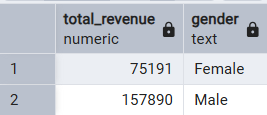
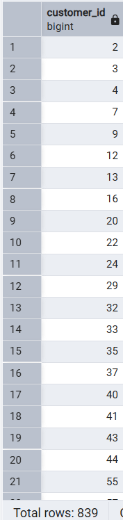
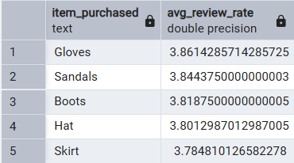
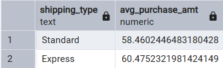
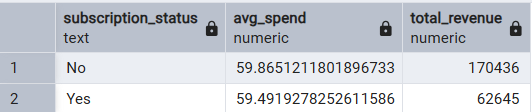
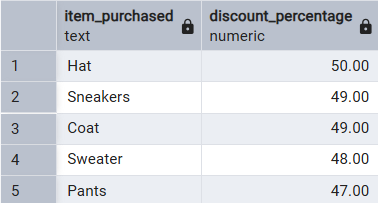
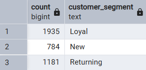
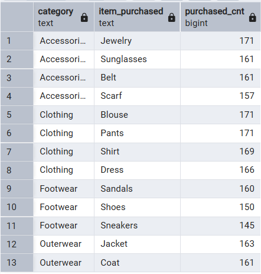
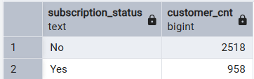
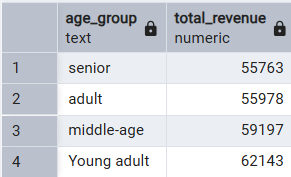

# Customer Behaviour Analysis

## Project Overview
This project focuses on analyzing customer purchasing behavior using Python, PostgreSQL, and Power BI. The objective is to uncover meaningful insights from customer transaction data, identify purchasing patterns, evaluate customer preferences, and create an interactive dashboard to support business decision-making.

---

## Dataset Summary

The dataset consists of **3,900 customer transaction records** with **18 columns**, capturing customer demographics, purchasing behavior, shopping preferences, and transaction details.

The features are grouped as follows:

### Customer Demographics
- Customer ID
- Age
- Gender
- Location

### Purchase Details
- Category
- Item Purchased
- Purchase Amount
- Previous Purchases
- Frequency of Purchases

### Shopping Preferences
- Size
- Color
- Season
- Shipping Type
- Payment Method

### Customer Experience
- Review Rating
- Subscription Status
- Discount Applied
- Promo Code Used

## Exploratory Data Analysis Using Python

Exploratory Data Analysis (EDA) was performed using **Python** to clean, transform, and prepare the dataset for PostgreSQL and Power BI.

### Libraries Used

- Pandas
- NumPy

### Data Cleaning

- Inspected the dataset structure and verified data types.
- Checked for missing values across all columns.

- Replaced missing values in the **Review Rating** column using the **median review rating of the corresponding product category**.


- Standardized column names by:
  - Converting all column names to lowercase.
  - Replacing spaces with underscores.


- Removed duplicate/redundant columns.
- Dropped the **promo_code_used** column since it contained the same information as **discount_applied**.

### Feature Engineering

- Created a new **age_group** column by categorizing customers into:
  - Young Adult
  - Adult
  - Middle Aged
  - Aged

- Created a new **purchases_frequency_days** column by converting categorical purchase frequencies into numerical values (days).

Examples:
- Weekly → 7
- Bi-Weekly → 14
- Fortnightly → 14
- Monthly → 30
- Quarterly → 90
- Annually → 365


### PostgreSQL Integration

Installed the required packages:

```bash
pip install psycopg2-binary sqlalchemy
```

Connected Python to PostgreSQL using **SQLAlchemy** and successfully loaded the cleaned dataset into the database.


## Data Analysis Using PostgreSQL

The cleaned dataset was loaded into PostgreSQL, where SQL queries were written to answer the following business questions:

### 1. What is the total revenue generated by male vs. female customers?



---

### 2. Which customers used a discount but still spent more than the average purchase amount?



---

### 3. Which are the top 5 products with the highest average review rating?



---

### 4. Compare the average purchase amounts between Standard and Express shipping.



---

### 5. Do subscribed customers spend more? Compare average spend and total revenue between subscribers and non-subscribers.



---

### 6. Which 5 products have the highest percentage of purchases with discounts applied?



---

### 7. Segment customers into New, Returning, and Loyal based on their total number of previous purchases, and show the count of each segment.



---

### 8. What are the top 3 most purchased products within each category?



---

### 9. Are customers who are repeat buyers (more than 5 previous purchases) also likely to subscribe?



---

### 10. What is the revenue contribution of each age group?



## Power BI Dashboard

An interactive Power BI dashboard was developed to visualize customer purchasing behavior and business performance using key metrics and charts.

### Dashboard Features

- **KPI Cards**
  - Total Customers
  - Average Purchase Amount
  - Average Review Rating
  - Total Discounted Purchases

- **Revenue Analysis**
  - Total Revenue by Product Category
  - Total Revenue by Gender

- **Customer Analysis**
  - Customer Distribution by Subscription Status
  - Customer Distribution by Shipping Type

- **Product Analysis**
  - Product Purchase Distribution using a Treemap
  - Most Purchased Products within Each Category

### Dashboard Insights

- Clothing contributes the highest overall revenue among all product categories.
- Male customers generate higher total revenue than female customers.
- The average purchase amount is **\$59.76**.
- The average customer review rating is **3.75**.
- The dataset contains **3.9K customers**, with approximately **2K discounted purchases**.
- Most customers are **non-subscribers**, accounting for nearly **73%** of the customer base.
- Shipping preferences are fairly balanced across all shipping methods.
- The treemap highlights the most frequently purchased products within each product category.

### Dashboard Preview


## Technologies Used

- Python
- PostgreSQL
- Power BI
- Pandas
- NumPy
- Matplotlib
- Seaborn
- SQL

---

## Project Structure

```
customer_behaviour_analysis/
│
├── customer_behaviour.ipynb
├── requirements.txt
├── README.md
├── PowerBI_Dashboard.pbix
├── dataset/
└── images/
```

---

## Author

**Roshika**
